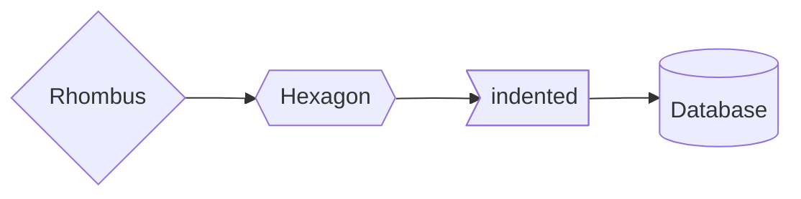

# Flowchart cheetsheet

## Nodes

### Node shapes




**Definition**

```
1("Round edges") --> 2(["Super Round edges"]) --> 3(("circle")) --> 4((("Double circle")));

5[["Bordered"]] --> 6[/"Parallelogram"/] --> 7[\"Parallelogram alt"\] --> 8[/"Trapezoid"\] --> 9[\"Trapezoid alt"/];

10{"Rhombus"} --> 11{{"Hexagon"}} --> 12>"indented"] --> 13[("Database")];
```

**[Flowchart Symbols Table](./flowchart_symbol.md)**


## Links Between nodes

### Link style


**Definition**

```
flowchart LR

    invisible ~~~ 0[invisible_link];
    Normal --- 1[Normal link with text];
    Dotted -.- 2[Dotted link with text];
    Thick === 3[Thick link with test];

    1 -- Text here ---End;
    2 -. Text here .-End;
    3 == Text here ===End;
```

### Arrowhead style


**Definition**

```
flowchart LR
    Arrow --> 1[Arrow Bidirectional] <--> 2[Arrow with text];
    Circle --o 3[Circle Bidirectional] o--o 4[Circle with text];
    Cross --x 5[Cross Bidirectional] x--x 6[Cross with text];

    2 -- text here --->End;
    4 -- text here ---oEnd;
    6 -- text here ---xEnd;
```

### Chaining of links

**1. Simple chaining**

Declare multiple links in the same line


**Definition**

```
flowchart LR
    1[simple chain] --> 2[simple chain with text] -- text here --> End;
```

**2. Split and combine chaining**

Declare mulitple nodes links in the same line


**Definition**

```
flowchart LR
    a --> b & c --> d;
```

**3. Multisplit chaining**

Used to describe dependencies


**Definition**

```
flowchart TD
    A --> C & D; 
    B --> C & D;
```

### Length of the links


**Definition**

```
flowchart LR
    Default --> Default2 --> Default3 --> Default4 -->Default5;
    Long ---> Long2 --->Long3;
    Superlong -----> Superlong2;
```

**Table for link length**

| Length            | 1   | 2    | 3     |
|-------------------|-----|------|-------|
| Normal            | --- | ---- | ----- |
| Normal with arrow | --> |--->  | ----> |
| Thick             | === | ==== | ===== |
| Thick with arrow  | ==> | ===> | ====> |
| Dotted            | -.- | -..- | -...- |
| Dotted with arrow | -.->| -..->| -...->|

## Graphs

### Orientation of Flowchart and graphs


<table>

<tr>
    <td>Position</td>
    <td>Standard</td>
    <td>Reversed</td>
</tr>

<tr>

<td>Vertical</td><td>

**TB**: Top to Bottom (also **TD**: Top to Down)


</td><td>

**BT**: Bottom to Top


</td></tr>

<tr>
<td>Horizontal</td><td>

**LR**: Left to Right


</td><td>

**RL**: Right to Left


</td></tr>
</table>

## Subgraph

### Definition


**Definition**

```
graph TD

    subgraph a
        a1 --> a2;
    end;
    subgraph b
        b1 --> b2;
    end;
    subgraph c
        c1 --> c2;
    end;
```

### Linking graphs and nodes


**Definition**

```
flowchart LR
    subgraph One
    a1;
    a2;
    end

    subgraph Two
    b1;
    b2;
    end

    subgraph Three
    c1;
    c2;
    end

    a1 -- "Node to Node" ---> a2;
    b1 -- "Node to Graph" --> Three;
    One -- "Graph to Node" ---> c2;
    One -- "Graph to Graph" ---> Two;
```

### Orientation of subgraph


**Definition**

```
flowchart TD
    subgraph Orientation

        subgraph A
        direction BT;
        a1--"Bottom to Top"--->a2;
        end

        direction RL
        A -- "Right to Left" ---> B;
        direction LR;
        B -- "Left to Right" ---> A;

        subgraph B
        direction TB;
        b1-- "Top to Bottom" --->b2;
        end
    end
```

## Markdown Strings inside Mermaid

Markdown string can be wrapped within the labels using ``"`string`"`` (string inside double quotes and double backticks)


**Definition**

```
flowchart TD
    subgraph Strings
        A("`The **cat** in the _hat_`");
        B{{"`The **dog** in the *_hog_*`"}};
    end
        A --"`Bold **Text**`"---> B;
```

## Comments

Comments are prefaced with `%%` (Double percent sign)


**Definition**

```
flowchart LR
%% This is a comment
    A --> B --> C;
```

## Styling

### Styling links

Using `linkStyle` command.


**Definition**

```
flowchart LR

    subgraph x
    direction LR
        subgraph One
        direction BT;
        a1;
        a2;
        end

        subgraph Two
        b1;
        b2;
        end
    end

    a1 --"0"--> a2; 
    One --"1"--> Two;
    b1 --"2"--> b2;
    Two --"3"--> One;

%% Individual link styling
    linkStyle 0 stroke:red, stroke-width:1px;
    linkStyle 1 stroke:yellow, stroke-width:2px;
    linkStyle 2 stroke:green, stroke-width:3px;
    linkStyle 3 stroke:purple, stroke-width:4px;

%% Group styling
    linkStyle 0,1,2,3 stroke:purple, stroke-width:4px;
```

### Styling Nodes

Use `style` command


**Definition**

```
flowchart LR
    id1(Start) --> id2(Stop);

%% Node styling
    style id1 fill:red, stroke:blue, stroke-width:4px;
    
    style id2 fill:yellow, stroke:red, stroke-width:4px, stroke-dasharray: 4 4;
```

### Individual Styling / Group Styling

* Individual styling

```mermaid
flowchart LR
    A;
    B;
    C;

    A --> B & C;

%% Individual styling
    style A stroke:Red;
    style B stroke:green;
```
**Definition**

```
flowchart LR
    A;
    B;
    C;

    A --> B & C;

%% Individual styling
    style A stroke:Red;
    style B stroke:green;
```

* Group styling

```mermaid
flowchart LR

    A;
    B; 
    C;

    A --> B & C;

%% Group styling
    class A Group;
    B:::Group;
    C:::Group;

    classDef Group fill:red, stroke:blue, stroke-width:4px;
```
**Definition**

```
flowchart LR

    A;
    B; 
    C;

    A --> B & C;

%% Group styling
    class A Group;
    B:::Group;
    C:::Group;

    classDef Group fill:red, stroke:blue, stroke-width:4px;
```

## Styling with classes in detail

Define a class of styles and attach this class to the nodes that should have different look.

* class definition

`classDef className propertyName:PropertyValue;`

* class definition in one line

`classDef 1stClassName, 2ndClassName propertyName:propertyValue`

* class attachment 

`class nodeId1 className;`

* * using `:::` operator

`nodeId1:::className;`

* class attachment in single line

`class nodeId1, nodeId2 className;`

```mermaid
flowchart LR

%% declaring nodes
        a;
        b;
        c;

%% class definitions
    classDef Node1 stroke:red;

    classDef Node2 stroke:green;

    classDef Node3 stroke:blue;

%% Attaching of classes to nodes
    a:::Node1;
    b:::Node2;
    c:::Node3;

%% Linking nodes
    a-->b & c;
```
**Definition**

```mermaid
flowchart LR

%% declaring nodes
        a;
        b;
        c;

%% class definitions
    classDef Node1 stroke:red;

    classDef Node2 stroke:green;

    classDef Node3 stroke:blue;

%% Attaching of classes to nodes
    a:::Node1;
    b:::Node2;
    c:::Node3;

%% Linking nodes
    a-->b & c;
```

### Styling all nodes

```mermaid
flowchart LR
    A --> B --> C;

    classDef default fill:green;
```
**Definiton**

```
flowchart LR
    A --> B --> C;

    classDef default fill:green;
```

