# Flowchart symbols

## Nodes Shape Sheets

<table>

<!-- First Row -->
<tr>
    <td>Name</td>
    <td>Diagram</td>
    <td>Definition</td>
</tr>

<!-- Second Row -->
<tr>
<td>

**Process**
</td><td>


</td><td>

```
flowchart 
    1["Process"]
```
</td>
</tr>

<!-- Third Row -->
<tr>
<td>

**Round edged node / Alt Process**
</td><td>


</td><td>

```
flowchart 
    2(["Alt Process"])
```
</td>
</tr>

<!-- Fourth Row -->
<tr>
<td>

**Oval / Terminator**
</td><td>


</td><td>

```
flowchart 
    3(["Terminator"])
```
</td>
</tr>

<!-- Fifth Row -->
<tr>
<td>

**Predefined Process / Bordered**
</td><td>


</td><td>

```
flowchart 
    4[["Predefined Process"]]
```
</td>
</tr>

<!-- Sixth Row -->
<tr>
<td>

**Input/Output (Parallelogram)**
</td><td>


</td><td>

```
flowchart 
    5[/"Input/Output"/]
```
</td>
</tr>

<!-- Seventh Row -->
<tr>
<td>

**Parallelogram alt**
</td><td>

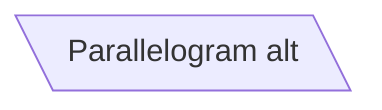
</td><td>

```
flowchart 
    6[\"Parallelogram alt"\]
```
</td>
</tr>

<!-- Eight Row -->
<tr>
<td>

**Trapezoid**
</td><td>

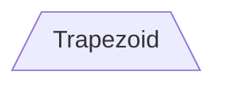
</td><td>

```
flowchart 
    7[/"Trapezoid"\]
```
</td>
</tr>

<!-- Ninth Row -->
<tr>
<td>

**Trapezoid alt**
</td><td>

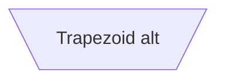
</td><td>

```
flowchart 
    8[\"Trapezoid alt"/]
```
</td>
</tr>

<!-- Tenth Row -->
<tr>
<td>

**Indented / Asymmetric shape**
</td><td>


</td><td>

```
flowchart 
    9>"Indented"]
```
</td>
</tr>


<!-- Eleventh Row -->
<tr>
<td>

**On-Page connector / circle**
</td><td>

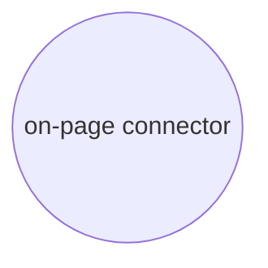
</td><td>

```
flowchart 
    10(("on-page connector"))
```
</td>
</tr>

<!-- Twelfth Row -->
<tr>
<td>

**Double circle**
</td><td>

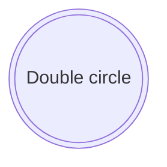
</td><td>

```
flowchart 
    11((("Double circle")))
```
</td>
</tr>

<!-- Thirteenth Row -->
<tr>
<td>

**Decision / Rhombus**
</td><td>

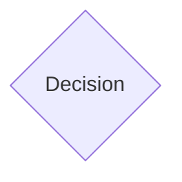
</td><td>

```
flowchart 
    12{"Decision"}
```
</td>
</tr>

<!-- Fourteenth Row -->
<tr>
<td>

**Preparation / Hexagon**
</td><td>


</td><td>

```
flowchart 
    13{{"Preparation"}}
```
</td>
</tr>

<!-- Fifteenth Row -->
<tr>
<td>

**Database / Cylinder**
</td><td>

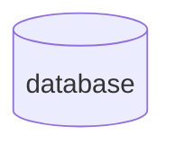
</td><td>

```
flowchart 
    13[("database")]
```
</td>
</tr>
</table>


## Link sheets

<table>


<tr><td>

**Links Length**
</td><td>

**1**
</td><td>

**2**
</td><td>

**3**
</td><td>

**Diagram**
</td><td>

**Definition**
</td></tr>


<tr><td> 

**Invisible** 
<td>

` ~~~ `
</td><td>

` ~~~~ `
</td><td>

` ~~~~~ `
</td><td>

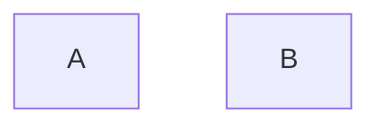
</td><td>

```
flowchart LR
    A ~~~ B
```
</td></tr>


<tr><td> 

**Normal** 
<td>

` --- `
</td><td>

` ---- `
</td><td>

` ---- `
</td><td>

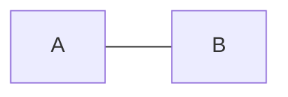
</td><td>

```
flowchart LR
    A --- B
```
</td></tr>


<tr><td> 

**Normal with Arrow** 
<td>

` --> `
</td><td>

` ---> `
</td><td>

` ----> `
</td><td>

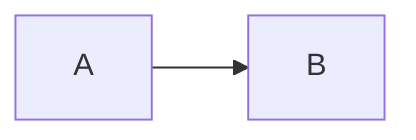
</td><td>

```
flowchart LR
    A --> B
```
</td></tr>


<tr><td> 

**Thick** 
<td>

` === `
</td><td>

` ==== `
</td><td>

` ===== `
</td><td>

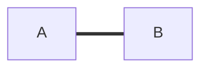
</td><td>

```
flowchart LR
    A === B
```
</td></tr>


<tr><td> 

**Thick with arrow** 
<td>

` ==> `
</td><td>

` ===> `
</td><td>

` ====> `
</td><td>

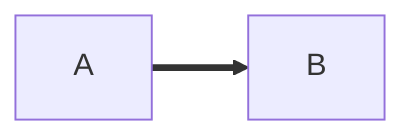
</td><td>

```
flowchart LR
    A ==> B
```
</td></tr>

<tr><td> 

**Dotted** 
<td>

` -.- `
</td><td>

` -..- `
</td><td>

` -...- `
</td><td>

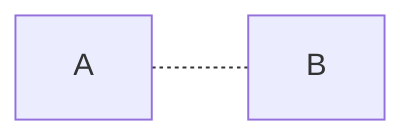
</td><td>

```
flowchart LR
    A -.- B
```
</td></tr>

<tr><td> 

**Dotted with Arrow** 
<td>

` -.-> `
</td><td>

` -..-> `
</td><td>

` -...-> `
</td><td>

```mermaid
flowchart LR
    A -.-> B
```
</td><td>

```
flowchart LR
    A -.-> B
```
</td></tr>

</table>