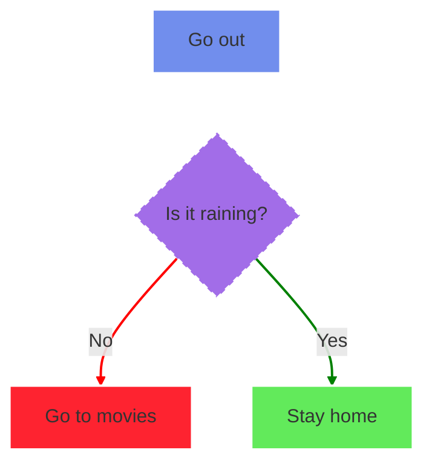

# Mermaid Reference sheet

A rewrite of the [Mermaid official documentation](https://mermaid.js.org/intro/getting-started.html) to use as a reference sheet (cheetsheet). [Mermaid live editor](https://mermaid.live/)

Inspired from [Jake Steam](https://github.com/JakeSteam/Mermaid)


<table>
<tr>
<td>Diagram</td>
<td>Definition</td>
</tr>
</table>




```code
flowchart TD
%% is it raining
    A["Go out"] --> B{"Is it raining?"} --"No"--> C["Go to movies"]

    B--"Yes"--> D["Stay home"]

   
    linkStyle 0 stroke:white, stroke-width:2px;
    linkStyle 1 stroke:red, stroke-width:2px;
    linkStyle 2 stroke:green, stroke-width:2px;

    style A fill:#718eed, stroke:white, stroke-width:2px;
    style B fill:#a26de8, stroke:white, stroke-width:2px, stroke-dasharray:5 5;
    style C fill:#fe2330, stroke:white, stroke-width:2px;
    style D fill:#62ea5b, stroke:white, stroke-width:2px;
```

