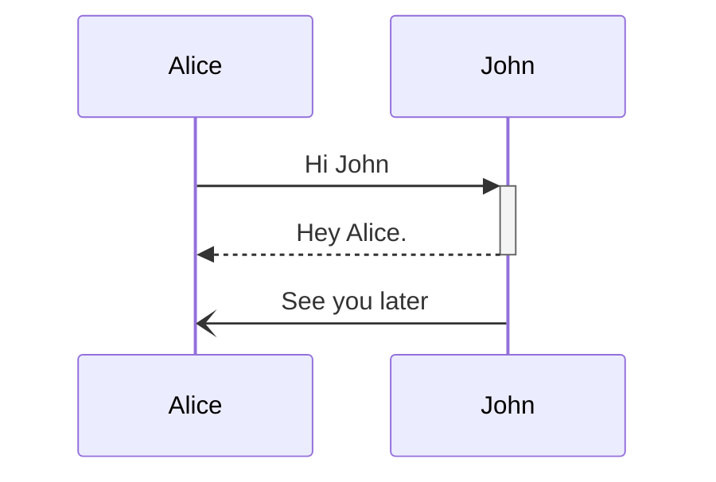

# Mermaid Reference sheet

A rewrite of the [Mermaid official documentation](https://mermaid.js.org/intro/getting-started.html) to use as a reference sheet (cheetsheet). [Mermaid live editor](https://mermaid.live/)

Inspired from [Jake Steam](https://github.com/JakeSteam/Mermaid)


<table>
<tr>
<td>Diagram</td>
<td>Definition</td>
</tr>

<tr><td>


</td><td>

```
flowchart LR
%% is it raining
    
    A["Go out"]
    B{"Is it raining?"}
    C["Go to movies"]
    D["Stay home"]
    
    A --> B
    B --"No"--> C
    B --"Yes"--> D
```

**[Flowchart in Detail](./flowchart/flowchart.md)**

**[Flowchart_Symbol Table](./flowchart/flowchart_symbol.md)**

</td></tr>

<tr><td>


</td><td>

```
sequenceDiagram
    participant Alice
    participant John

    Alice ->>+ John: Hi John
    John -->>-Alice: Hey Alice.
    John -) Alice: See you later
```
**[Sequence Diagrams in detail](./sequence/sequence.md)**

</td></tr>


</table>