# Control flow fragments

Provide a way to model complex interaction scenarios beyond simple linear message sequences.

(Graphical elements (usually a rectangle) used to depict the order and conditional execution of messages exchanged between participants)


## Loops

Represents a sequence of messages that can be repeated a specific number of times. using this notation

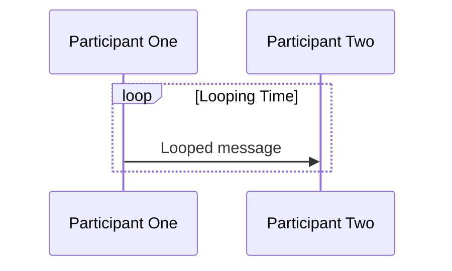
**Example: Login system**

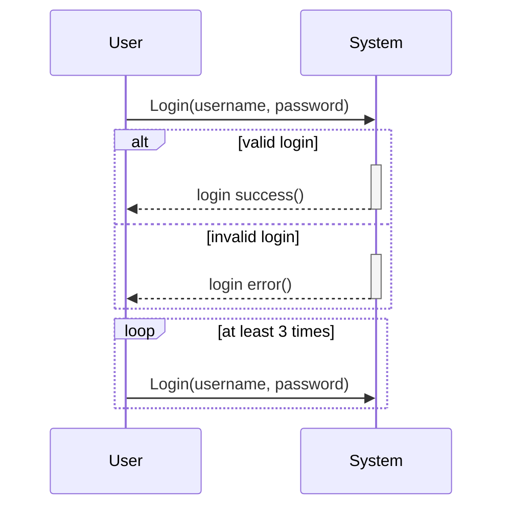

-----


**Definition**

```
sequenceDiagram
    participant User
    participant System

    User ->> System: Login(username, password)
    alt valid login
        activate System
            System -->> User: login success()
        deactivate System
    else invalid login
        activate System
            System -->> User: login error()
        deactivate System
    end

    loop at least 3 times
        User ->> System: Login(username, password)
    end
```

## Alt (alternative)

Represents a branching point where only one of the alternative message sequence will be executed based on a condition. Like a if/else statement.

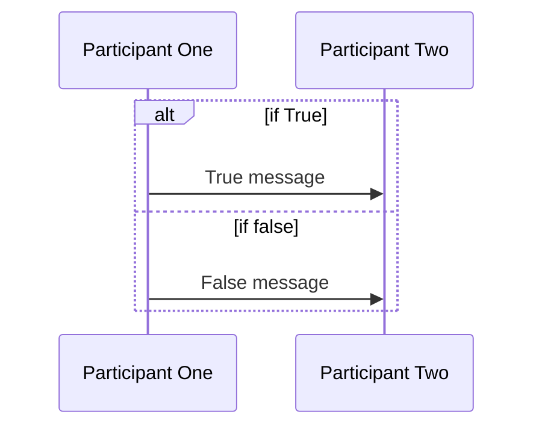

**Example: Login system**


**Definition**

```
sequenceDiagram
    participant User
    participant System

    User ->> System: Login(username, password)
    alt valid login
        activate System
            System -->> User: login success()
        deactivate System
    else invalid login
        activate System
            System -->> User: login error()
        deactivate System
    end

    loop at least 3 times
        User ->> System: Login(username, password)
    end
```

## Opt (optional)

Represents an optional message sequence that may or may not be executed on a condition.

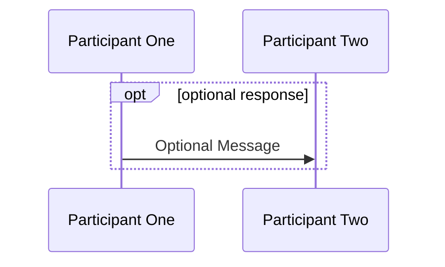

**Example: Buying a Gift**

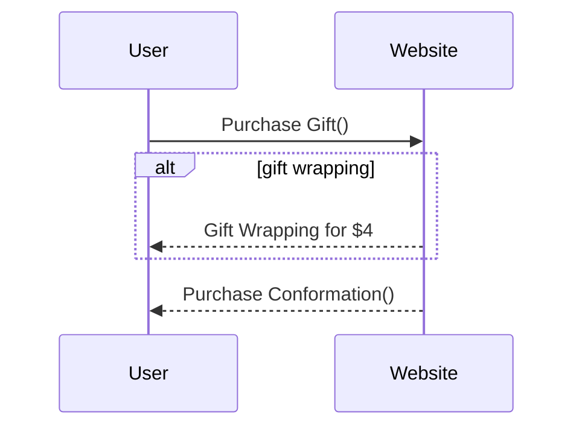


**Definition**

```
sequenceDiagram
    participant User
    participant Website

    User ->> Website: Purchase Gift()

    alt gift wrapping
        Website -->> User: Gift Wrapping for $4
    end

    Website -->> User: Purchase Conformation()
```

## Par (Parallel)

Represents concurrent execution of multiple messages sequences, allowing independent processing by different participant. It can also be nested

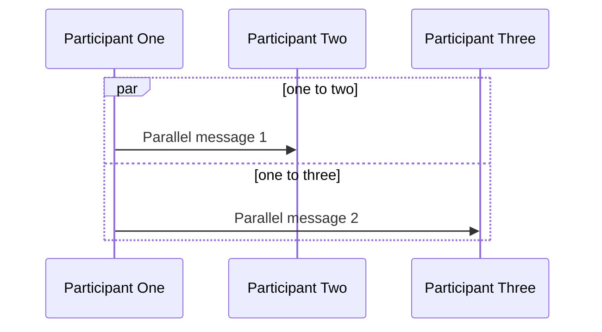

**Example: Multiple requests**

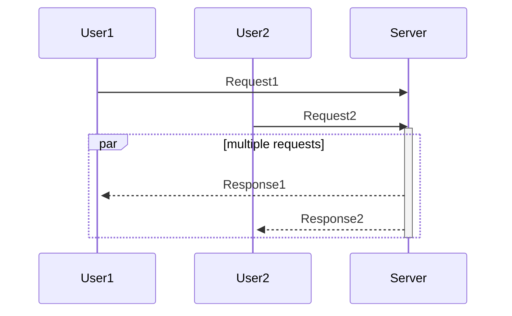


**Definition**

```
sequenceDiagram
    participant User1
    participant User2
    participant Server

    User1 ->> Server: Request1
    User2 ->> Server: Request2
    activate Server

%% parallel
    par multiple requests
        Server -->>+ User1: Response1
        Server -->>+ User2: Response2
    end
    deactivate Server
```

## Critical Region

Represents a section where action must happen automatically with conditional handling of circumstances.

(it is possible to have with no options)

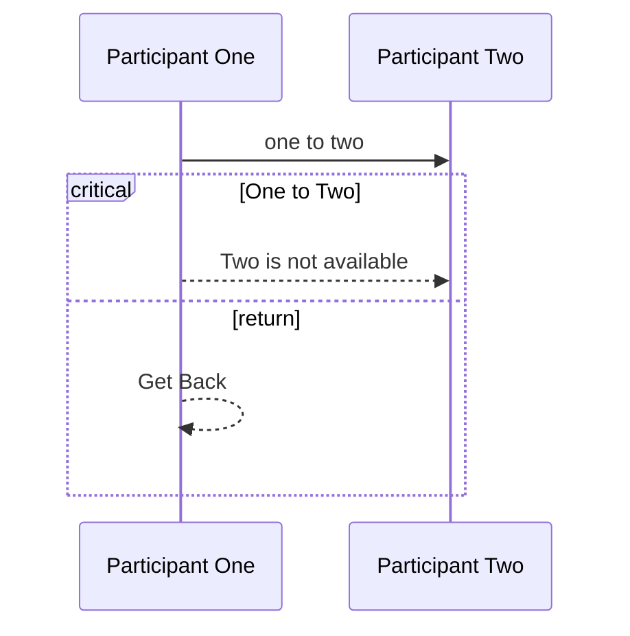

**Example: Client Server connection**

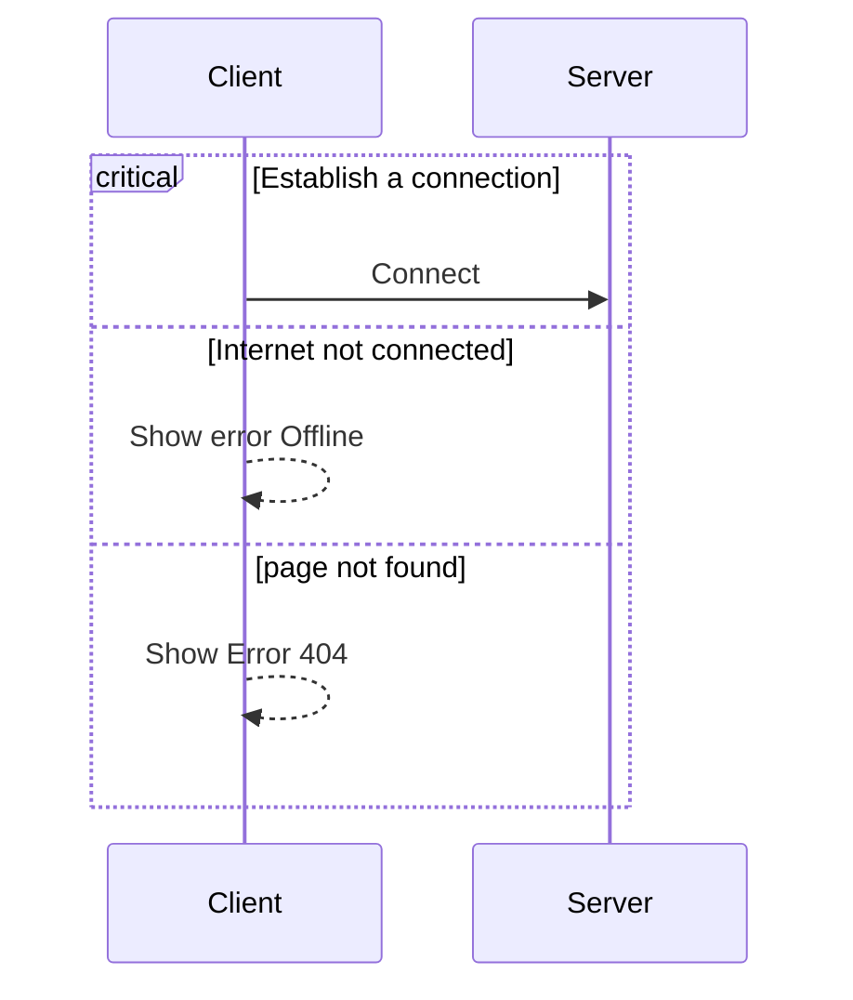

**Definition**

```
sequenceDiagram
    participant Client
    participant Server

%% critical
    critical Establish a connection
        Client ->> Server: Connect
    option Internet not connected
        Client -->> Client: Show error Offline
    option page not found
        Client -->> Client: Show Error 404
    end
```

## Par and Critical can also be nested

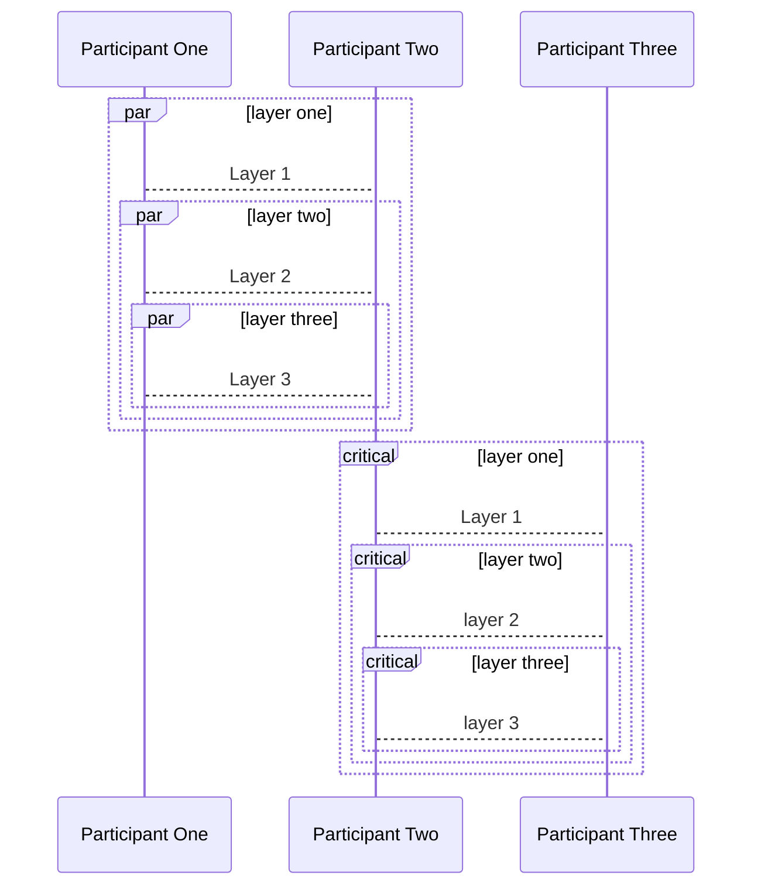

**Definition**

```
sequenceDiagram
    participant One as Participant One
    participant Two as Participant Two
    participant Three as Participant Three

%% Nested par
    par layer one
        One --> Two: Layer 1
        par layer two
            One --> Two: Layer 2
            par layer three
                One --> Two: Layer 3
            end
        end
    end

%% Nested Critical
    critical layer one
        Two --> Three: Layer 1
        critical layer two
            Two --> Three: layer 2
            critical layer three
                Two --> Three: layer 3
            end
        end
    end
```

## Break

Represents an message sequence that stops the remaining interaction within the flow, if a specific condition is me (Used ot model exceptions).


**Example 1: Forgot Password**

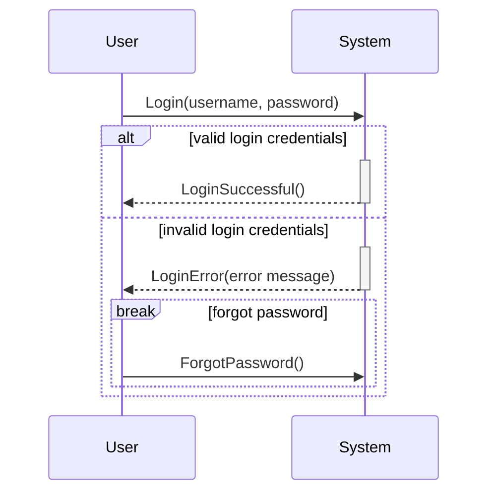

**Definition**

```
sequenceDiagram
    participant User
    participant System

    User ->> System: Login(username, password)

    alt valid login credentials
        activate System
        System -->> User: LoginSuccessful()
        deactivate System
    else invalid login credentials
        activate System
        System -->> User: LoginError(error message)
        deactivate System

        break forgot password
            User ->> System: ForgotPassword()
        end
    end
```

**Example 2: Book a ticket**

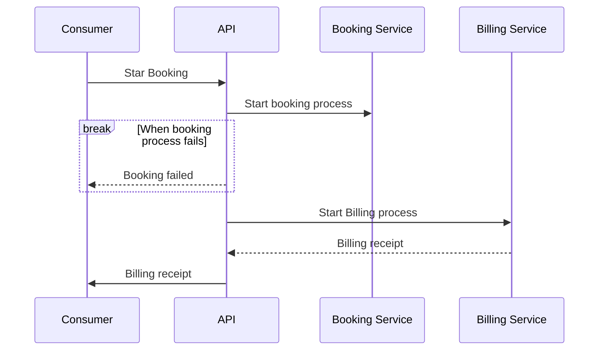
**Definition**

```
sequenceDiagram
    participant Consumer
    participant API
    participant Booking as Booking Service
    participant Billing as Billing Service

    Consumer ->> API: Star Booking

    API ->> Booking: Start booking process

    break When booking process fails
        API -->> Consumer: Booking failed
    end 

    API ->> Billing: Start Billing process

    Billing -->> API: Billing receipt
    API ->> Consumer: Billing receipt
```