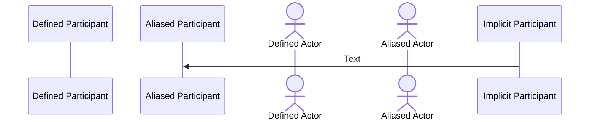
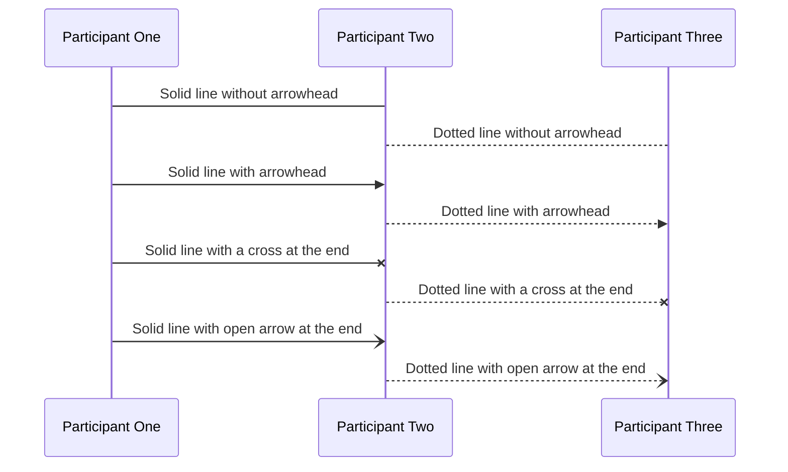
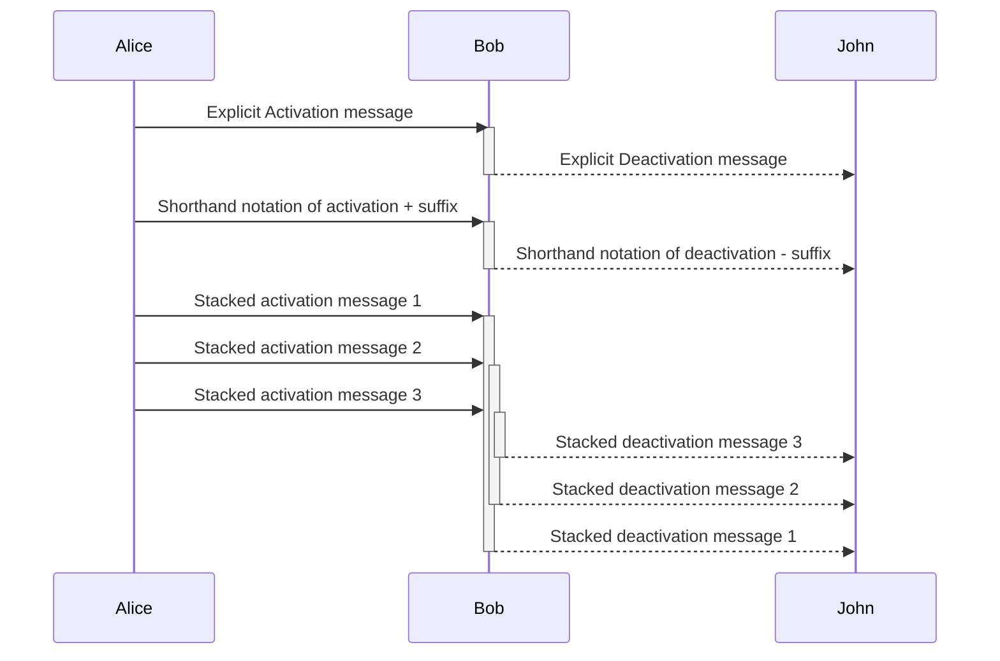
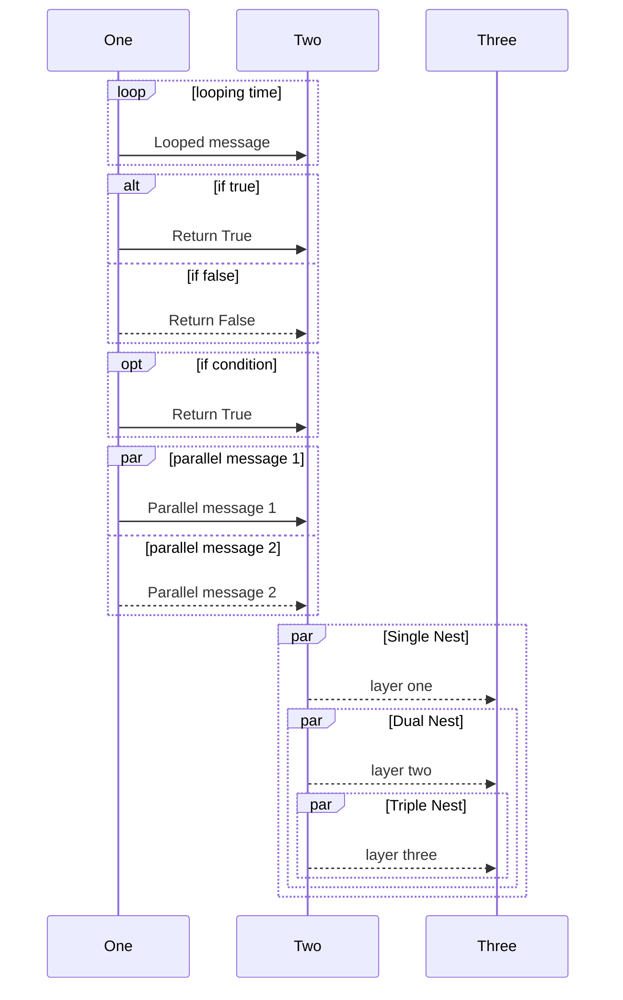
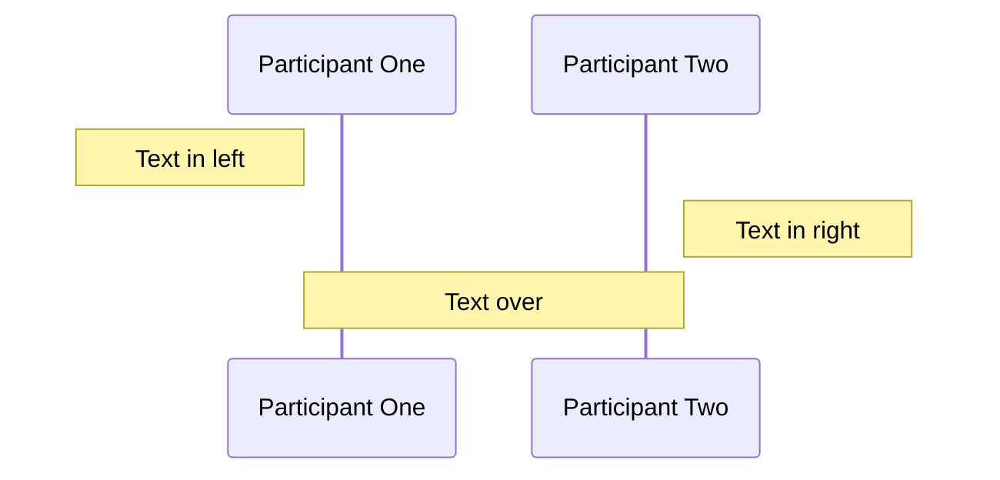
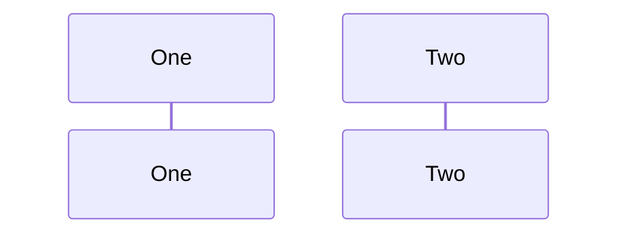

# Sequence Diagram

## Participants

### Types of participant



**Definition**

```
sequenceDiagram

%% Defined participant
    participant Defined Participant

%% Aliased Participant
    participant P as Aliased Participant

%%Defined actor
    actor Defined Actor
%% Aliased actor
    actor A as Aliased Actor

%% Implicitly defining participant
    Implicit Participant ->> P:Text
```

## Messages

### Message Indicators



**Definition**

```
sequenceDiagram
    participant One as Participant One
    participant Two as Participant Two
    participant Three as Participant Three

    One -> Two:Solid line without arrowhead
    Two --> Three: Dotted line without arrowhead

    One ->> Two: Solid line with arrowhead
    Two -->> Three: Dotted line with arrowhead

    One -x Two: Solid line with a cross at the end
    Two --x Three: Dotted line with a cross at the end

    One -) Two: Solid line with open arrow at the end
    Two --) Three: Dotted line with open arrow at the end
```

<table>

<tr><td>

**Type**
</td><td>

**Description**
</td></tr>

<tr><td>

`->` 
</td><td>

Solid line without arrow
</td></tr>

<tr><td>

`-->` 
</td><td>

Dotted line without arrow
</td></tr>

<tr><td>

`->>` 
</td><td>

Solid line with arrowhead
</td></tr>

<tr><td>

`-->>` 
</td><td>

Dotted line with arrowhead
</td></tr>

<tr><td>

`-x` 
</td><td>

Solid line with a cross at the end.
</td></tr>

<tr><td>

`--x` 
</td><td>

Dotted line with a cross at the end.
</td></tr>

<tr><td>

`-)` 
</td><td>

Solid line with an open arrow the end
</td></tr>

<tr><td>

`--)` 
</td><td>

Dotted line with an open arrow at the end 
</td></tr>

</table>

### Message Activation




**Definition**

```
sequenceDiagram

    participant Alice
    participant Bob
    participant John

%% Explicitly activating / deactivating actors or participants
    Alice ->> Bob: Explicit Activation message
    activate Bob
    Bob -->> John: Explicit Deactivation message
    deactivate Bob

%% Using activation shorthand notation activation / deactivation (+/-)
    Alice ->>+ Bob: Shorthand notation of activation + suffix
    Bob -->>- John: Shorthand notation of deactivation - suffix

%% Stacking messages
    Alice ->>+ Bob: Stacked activation message 1
    Alice ->>+ Bob: Stacked activation message 2
    Alice ->>+ Bob: Stacked activation message 3

    Bob -->>- John: Stacked deactivation message 3
    Bob -->>- John: Stacked deactivation message 2
    Bob -->>- John: Stacked deactivation message 1
```

## Control flow fragments

**[Control flow fragments in detail](./contol_flow.md)**



**Definition**

```
sequenceDiagram
    participant One
    participant Two
    Participant Three

%% loop
    loop looping time
        One ->> Two: Looped message
    end

%% alt (alternative)
    alt if true
        One ->> Two: Return True
    else if false
        One -->> Two: Return False
    end

%% opt (optional)
    opt if condition
        One ->> Two: Return True
    end

%% par (parallel)
    par parallel message 1
        One ->> Two: Parallel message 1
    and parallel message 2
        One -->> Two: Parallel message 2
    end

%% Par Nested
    par Single Nest
        Two -->> Three: layer one
        par Dual Nest
            Two -->> Three: layer two
            par Triple Nest
                Two -->> Three: layer three
            end
        end 
    end
```

## Miscellaneous

### Notes


**Definition**

```
sequenceDiagram
    participant One as Participant One
    participant Two as Participant Two


    note left of One : Text in left
    note right of Two : Text in right
    note over One, Two : Text over
```

### Participant links

Participants can have popup menus containing links to external pages.

